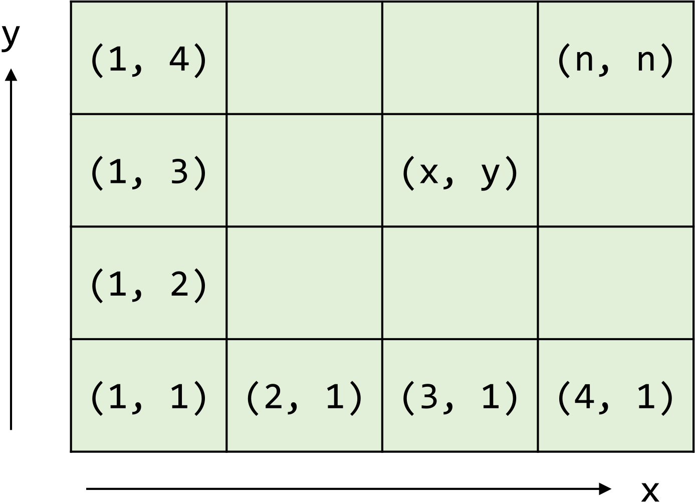
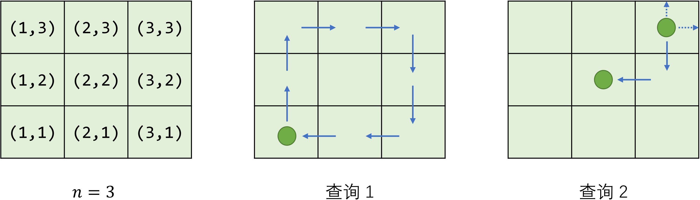

# 移动

- 认证：第36次CCF计算机软件能力认证
- 认证编号：36
- 题目序号：1
- 题目编号：181
- 题面 token：181.sQJKXTYcFn8IeSHY

---


**时间限制：** 1.0 秒 


**空间限制：** 512 MiB

**相关文件：** 题目目录


## 题目背景

西西艾弗岛某山脉深处出土了一台远古机器人，具体年代已不可考。初步修缮后，研究人员尝试操控机器人进行些简单的移动。

## 题目描述

整个实验场地被划分为 $n \times n$ 个方格，从 $(1, 1)$ 到 $(n, n)$ 进行编号。机器人只能在这些方格间移动，不能走出场地范围。



假设机器人当前位于 $(x, y)$，那么接下来可以向前后左右任意方向移动一格：

* 向前移动 `f`：$(x, y) \rightarrow (x, y+1)$
* 向后移动 `b`：$(x, y) \rightarrow (x, y-1)$
* 向左移动 `l`：$(x, y) \rightarrow (x-1, y)$
* 向右移动 `r`：$(x, y) \rightarrow (x+1, y)$

特别地，如果移动的目标位置不在场地范围内，则机器人位置保持不变。这样，使用由 `f`、`b`、`l` 和 `r` 组成的指令序列便可操纵机器人在场地上自由移动。

试处理 $k$ 个查询：每个查询包含一个机器人起始位置 $(x, y)$（$1 \le x, y \le n$）和一个移动指令序列（由 `fblr` 四个字母组成的字符串），输出执行完移动指令后的最终位置。

## 输入格式

从标准输入读入数据。

输入的第一行包含空格分隔的两个正整数 $n$ 和 $k$，分别表示场地大小和查询个数。

接下来 $k$ 行：每行包含空格分隔的两个正整数 $x$、$y$ 和一个由 `fblr` 四个字母组成的字符串，表示一个查询。

## 输出格式

输出到标准输出。

每个查询输出一行：包含空格分隔的两个正整数 $x$ 和 $y$，表示对应查询的最终位置。


## 样例输入

```plain
3 2
1 1 ffrrbbll
3 3 frbl

```


## 样例输出

```plain
1 1
2 2

```


## 样例解释

  

## 子任务

$50\%$ 的测试数据满足：指令序列不会试图将机器人移出场地（即无需考虑场地边界，如样例中的查询 1）；

全部的测试数据满足：$n$、$k$ 和每个指令序列的长度均大于 $0$ 且不超过 $100$。
