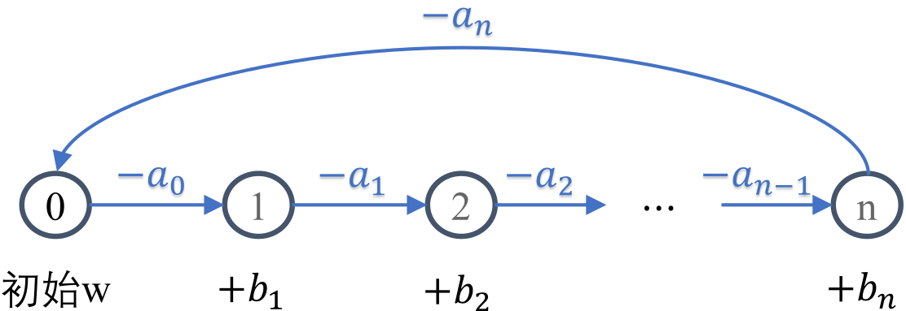

# 梦境巡查

- 认证：第36次CCF计算机软件能力认证
- 认证编号：36
- 题目序号：2
- 题目编号：182
- 题面 token：182.3FmGAD6RWP1oNsMo

---


**时间限制：** 1.0 秒 


**空间限制：** 512 MiB

**相关文件：** 题目目录


## 题目背景

传说每当月光遍布西西艾弗岛，总有一道身影默默守护着居民们的美梦。

## 题目描述

梦境中的西西艾弗岛由 $n+1$ 个区域组成。梦境巡查员顿顿每天都会从梦之源（$0$ 号区域）出发，顺次巡查 $1, 2, \cdots, n$ 号区域，最后从 $n$ 号区域返回梦之源。

在梦境中穿梭需要消耗美梦能量：

* 从梦之源出发时，顿顿会携带若干初始能量；
* 从第 $i$ 号区域前往下一区域（$0 \le i \le n$）需要消耗 $a_i$ 单位能量，因此从第 $i$ 号区域出发时，顿顿剩余的美梦能量需要**大于或等于** $a_i$ 单位；
* 顺利到达第 $i$ 号区域（$1 \le i \le n$）后，顿顿可以从当地居民的美梦中汲取 $b_i$ 单位能量作为补给。

假设顿顿初始携带 $w$ 单位美梦能量，那么首先需要保证 $w \ge a_0$，这样顿顿便可消耗 $a_0$ 能量穿梭到 $1$ 号区域、进而获得 $b_1$ 单位能量补给。巡查 $1$ 号区域后，顿顿剩余能量为 $w - a_0 + b_1$，如果该数值大于或等于 $a_1$，顿顿便可继续前往 $2$ 号区域。依此类推，直至最后消耗 $a_n$ 单位能量从 $n$ 号区域返回梦之源，便算是顺利完成整个巡查。西西艾弗岛，又迎来安宁的一夜，可喜可贺！

<p class="text-center"></p>

作为一个成熟的梦境巡查员，顿顿已经知晓初始需要携带多少能量可以保证顺利完成巡查。但在一些意外状况下，比如学生们受期末季的困扰而无法安眠，顿顿可能在某些区域无法采集足够的美梦能量。此时，便需要增加初始携带量以备万全。

具体来说，考虑一个简单的情况：在 $1$ 到 $n$ 号区域中，有且仅有一个区域发生意外，顿顿无法从该区域获得能量补给。
如果第 $i$ 号区域（$1 \le i \le n$）发生意外（即 $b_i$ 变为 $0$），则此时为顺利完成巡查，顿顿从梦之源出发所携带的最少初始能量记作 $w(i)$。

试帮助顿顿计算 $w(1), w(2), \cdots, w(n)$ 的值。

## 输入格式

从标准输入读入数据。

输入共三行。

输入的第一行包含一个整数 $n$。

输入的第二行包含 $n+1$ 个整数 $a_0, a_1, a_2, \cdots, a_n$。

输入的第三行包含 $n$ 个整数 $b_1, b_2, \cdots, b_n$。

## 输出格式

输出到标准输出。

输出仅一行，包含空格分隔的 $n$ 个整数 $w(1), w(2), \cdots, w(n)$。


## 样例1输入

```plain
3
5 5 5 5
0 100 0

```


## 样例1输出

```plain
10 20 10

```


## 样例1解释

$1$ 和 $3$ 号区域本身便没有补给，需要携带 $10$ 单位初始能量抵达 $2$ 号区域，获得 $2$ 号区域的大量补给后便可顺利完成巡查；

$2$ 号区域发生意外，则全程没有补给，初始需携带 $20$ 单位能量。


## 样例2输入

```plain
3
9 4 6 2
9 4 6

```


## 样例2输出

```plain
15 10 9

```


## 子任务

$80\%$ 的测试数据保证 $0 < n \le 1000$；

全部测试数据保证 $0 < n \le 10^{5}$ 且 $0 \le a_i, b_i \le 1000$。
