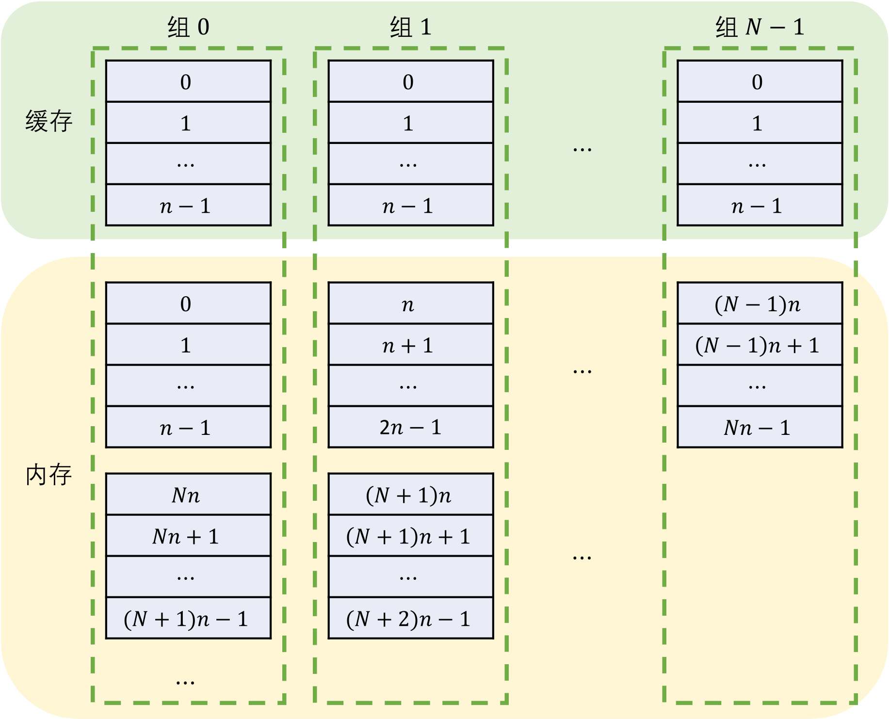

# 缓存模拟

- 认证：第36次CCF计算机软件能力认证
- 认证编号：36
- 题目序号：3
- 题目编号：183
- 题面 token：183.yTaqoyfeBvFa8pQP

---


**时间限制：** 1.0 秒 


**空间限制：** 512 MiB

**相关文件：** 题目目录


## 题目背景

西西艾弗岛半导体制造厂近期正在研发一种新型的处理器产品。该处理器的缓存，计划采用**组相连**的方式。
为了选定合适的**组相连**参数，我们需要对缓存的工作过程进行模拟，进而推算其性能。

处理器的**缓存**，存储着**内存**中的部分数据。当处理器的运行需要访问**内存**中的数据时，如果所需数据已经存储在**缓存**中，则可以用更为快捷的**缓存**访问代替**内存**访问，来提高处理器性能。

处理器的缓存包含若干**缓存行**，每个**缓存行**存储特定大小的数据。为了便于叙述，我们认为处理器对内存的访问，也是以**缓存行**为单位进行的。
以**缓存行**的大小为单位，将全部内存空间划分为若干块（编号从 $0$ 开始），这样每个**内存块**的数据便可以恰好存储在一个**缓存行**中。

**$n$-路组相联**是这样的一种缓存结构：每 $n$ 个**缓存行**划分为一组。假设共有 $N$ 个这样的**组**（编号从 $0$ 到 $N - 1$），那么编号为 $k$ 的**内存块**仅可以被存储在编号为 $(k \div n) \% N$ 的**组**这 $n$ 个**缓存行**的任意一个中。其中，$\div$ 表示忽略余数的整除运算，$\%$ 表示整除取余数运算。一般而言，$n$ 和 $N$ 是 $2$ 的幂次。例如，当 $n=4$、$N=8$ 时，编号为 0、1、2、3、32、33、34、35 的**内存块**可以被存储在**组** 0 的任意**缓存行**中；编号为 4、5、6、7、36、37、38、39 的**内存块**可以被存储在**组** 1 的任意**缓存行**中。

<p class="text-center"></p> 

## 题目描述

具体而言，给定要**读取**或**写入**的内存块编号，即可确定该内存块可能位于的缓存行组的编号。此时，可能存在的情况有两种：

- 该缓存行组的某个缓存行已经存储了该内存块的数据，即**命中**；
- 该缓存行组的所有缓存行都没有存储该内存块的数据，即**未命中**。

当发生**命中**时，处理器可以直接使用或修改该缓存行中的数据，而不需要实际读写内存。
当发生**未命中**时，处理器需要**从内存中读取数据**，并将其存储到该缓存行组中的一个缓存行中，然后再使用或修改该缓存行中的数据。这个将内存中的数据读入到缓存的过程称为**载入**。

当执行**载入**操作时，如果该缓存行组中有尚未存储数据的缓存行，那么将数据存储到其中一个尚未存储数据的缓存行中，并在缓存行中记录所存储的数据块的编号；否则，按照一定方法，选择该组中的一个缓存行，并将数据存储到其中，这一过程称为**替换**。

当发生**替换**时，需要考虑被替换的缓存行是否发生过修改，即执行过**写**操作。如果发生过修改，则需要先**将缓存行中的数据写入内存中的对应位置**；然后忽略该缓存行中的数据、将新读入的数据存入其中，并记录所存储数据块的编号。

在一个缓存行组中选择被替换的缓存行的方法有很多种，该种处理器采用的是**最近最少使用**（LRU）方法。该方法将一个缓存行组中存有数据的缓存行排成一队，每次读或写一个缓存行时，都将该缓存行移动到队列的最前端。当需要替换缓存行时，选择队列的最后一个缓存行（最久没被读写）进行替换。

本题目中，将给出一系列的处理器运行时遇到的对内存的读写指令，并假定初始时处理器的缓存为空。你需要根据上文描述的缓存工作过程，给出处理器对内存的实际读写操作序列。

## 输入格式

从标准输入读入数据。

输入的第一行包含空格分隔的三个整数 $n, N, q$，分别表示组相联的路数 $n$ 和组数 $N$，以及要处理的读写指令的数量 $q$。

接下来 $q$ 行，每行包含空格分隔的两个整数 $o$ 和 $a$。其中，$o$ 表示读写指令的类型，$a$ 表示要读写的内存块的编号。$o$ 为 $0$ 或 $1$，分别表示读和写操作。

## 输出格式

输出到标准输出。

输出若干行，每行包含空格分隔的两个整数 $o'$ 和 $a'$，表示实际处理器对内存的读写操作。$o'$ 为 $0$ 或 $1$，分别表示读和写操作；$a'$ 表示要读写的内存块的编号。


## 样例输入

```plain
4 8 8
0 0
0 1
1 2
0 1
1 0
0 32
1 33
0 34

```


## 样例输出

```plain
0 0
0 1
0 2
0 32
1 2
0 33
0 34

```


## 样例解释

该处理器的缓存为 4 路组相联，共有 8 组。初始时，处理器的缓存为空。共需要处理 8 条指令：

- 第 1 条指令为读取内存块 0，未命中，要实际读取内存块 0，并存储到组 0 的一个缓存行；
- 第 2 条指令为读取内存块 1，未命中，要实际读取内存块 1，并存储到组 0 的另一个缓存行；
- 第 3 条指令为写入内存块 2，未命中，要实际读取内存块 2，并存储到组 0 的第三个缓存行，然后根据指令在缓存中对其进行修改；
- 第 4 条指令为读取内存块 1，命中，直接从缓存中调取数据；
- 第 5 条指令为写入内存块 0，命中，直接修改缓存中的数据；
- 第 6 条指令为读取内存块 32，未命中，要实际读取内存块 32，并存储到组 0 的第四个缓存行；
- 第 7 条指令为写入内存块 33，未命中，此时组 0 中的 4 个缓存行都保存了数据：最近使用的是保存有内存块 32 的缓存行，其次是保存有内存块 0 的缓存行，然后是 1，最后是 2，因此选择替换保存有内存块 2 的缓存行。注意到该缓存行在执行第 3 条指令时被修改过，因此需要先将其写入内存，然后再读取内存块 33 的数据存储到该缓存行中；
- 第 8 条指令为读取内存块 34，未命中，此时组 0 中的 4 个缓存行都保存了数据，按照同样的办法，选择保存有内存块 1 的缓存行替换。注意到该缓存行未被修改过，因此可以直接读取内存块 34 的数据存储到该缓存行中。

## 子任务

对于 20% 的数据，有 $n = 1, N = 1$；

对于 40% 的数据，有 $n = 1$；

另外 20% 的数据，有 $N = 1, q \le n$；

对于 100% 的数据，有 $1 \le n, N, n \times N \le 65536$，且 $n, N$ 为 2 的幂次；$1 \le q \le 10^5$，$0 \le a < 2^{30}$。
