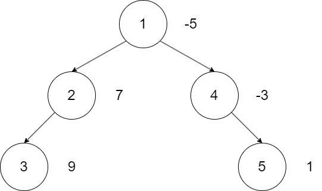
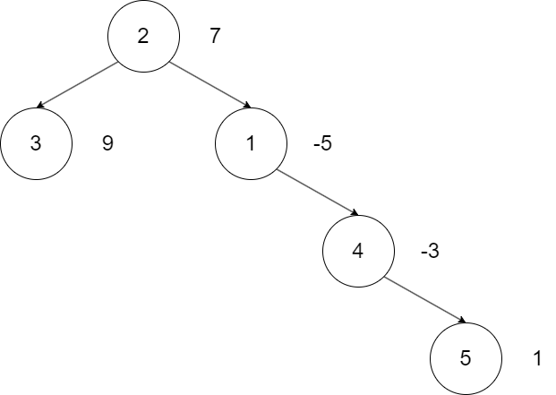
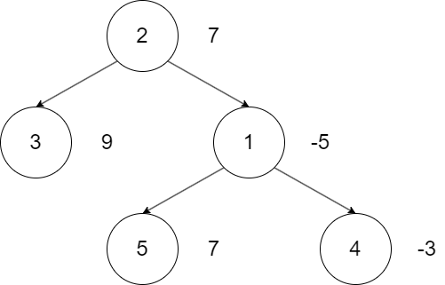

# 收费标准评估

- 认证：第37次CCF计算机软件能力认证
- 认证编号：37
- 题目序号：5
- 题目编号：190
- 题面 token：190.oa3aJjlfzKLbzWVz

---
**时间限制：** 2.5 秒 

**空间限制：** 512 MiB

**相关文件：** [题目目录](../assets/staticdata/186.eqMZbXNG9mOOtUz0.pub/HWj4VPL5AvlT0DZn.CSP37-down.zip/CSP37-down.zip)

## 题目背景

西西艾弗岛上的西埃斯公园正在进行收费标准评估。

## 题目描述

西埃斯公园内建有 $n$ 个景点，编号从 $1$ 到 $n$，其中第 $i$ 号景点的收费为 $a_i$。
特别地，为鼓励居民入园游览，部分景点可能有打卡领红包活动，因此 $a_i$ 可能是负数。
全部景点由 $n-1$ 条**可以双向通行**的道路连通，因此园区路线图可以看作是一个具有 $n$ 个节点的树。

每天园区中会有一个景点举办演出，为了方便描述景点间的远近关系，我们不妨称该景点为整棵树的根节点。
初始时，$1$ 号景点为**演出景点**（根节点）。
这样，景点 $u$ 的子树即为：从 $u$ 出发，向着远离根节点方向前进可以到达的所有景点（包含 $u$ 自身）。

游客可以从任意景点入园游览。当游客从景点 $u$ 入园时，由于可以沿着园区内的双向道路反复行走，该次游览到达的所有景点是一个**包含节点 $u$ 的连通区域**。
当游览结束时，公园将根据游客到达的景点进行收费，每个到达的景点计费一次（即使多次到达）。该次游览的总费用即为到达的所有景点费用 $a_i$ 之和。

由于西埃斯公园是西西艾弗岛的非盈利机构，园区收费必须设置在合理水平——既能维持公园运营、也能便于居民入园游览。
园区的**基本费用**就是一项重要的评估指标，具体定义为：游客从**演出景点**（根节点）入园游览一次可能的最大花费。

公园管理部门希望开发一套评估系统，该系统将首先计算一次**基本费用**，然后处理如下四种操作：

- $1\~u$：假设当日园区只开放景点 $u$ 的子树区域（游客只能在该区域入园、游览），计算游客从任意景点入园游览一次的最大花费。该操作只为评估收费水平，并没有真正关闭部分区域，对后续操作无影响。
- $2\~u\~x$：将景点 $u$ 的收费 $a_u$ 调整为 $x$，然后重新计算**基本费用**。
- $3\~u$：将**演出景点**（根节点）更改为景点 $u$，然后重新计算**基本费用**。
- $4\~a\~b\~c\~d$：园区道路施工，将原本连接景点 $a$ 和 $b$ 的道路取消，并新建一条连接景点 $c$ 和 $d$ 的双向道路，然后重新计算**基本费用**。保证操作前道路 $a-b$ 存在，道路 $c-d$ 不存在，且操作后园区整体仍为一棵树。

你的任务就是帮助西埃斯公园开发这套评估系统。

## 输入格式

从标准输入读入数据。

输入第一行：两个正整数 $n,m$，分别表示西埃斯公园的景点数与评估系统待处理的操作数。

输入第二行：$n$ 个整数 $a_i$，表示初始时每个景点的收费（可能是负数）。

接下来 $n-1$ 行：每行 $2$ 个正整数 $u,v$，表示初始时有一条连接景点 $u$ 和 $v$ 的双向道路。

接下来 $m$ 行：每行 $2$ 到 $5$ 个整数，描述一个操作。

## 输出格式

输出到标准输出。

输出 $m+1$ 行，每行一个整数，分别表示初始时的**基本费用**及每次操作的计算结果。


## 样例输入

```plain
5 4
-5 7 9 -3 1
1 2
1 4
2 3
4 5
1 1
3 2
2 5 7
4 5 4 1 5

```


## 样例输出

```plain
11
16
16
16
18

```


## 样例解释

0. 初始时西埃斯公园的路线图如下，其中道路的箭头是从靠近根的景点指向远离根的景点（仅用于指示方位、道路均可双向通行）。节点内部数字为景点编号，右侧数字为该景点的收费。初始时，从景点 $1$ 出发，选择游览 $1,2,3$ 号景点可导致最大花费 $(-5)+7+9=11$。

<p class="text-center"></p>

1. 查询当仅景点 $1$ 的子树区域开放时（即全部景点开放）一次游览的最大花费。这种情况下，选择游览 $2,3$ 号景点可导致最大花费 $7+9=16$。

2. 将**演出景点**改至景点 $2$，西埃斯公园整体结构变为下图。此时从景点 $2$ 出发，选择游览 $2,3$ 号景点可导致最大花费 $7+9=16$。

<p class="text-center"></p>

3. 将景点 $5$ 的收费改为 $7$。此时从景点 $2$ 出发，由于参观景点 $5$ 必须经过 $1,4$ 号景点，仍然是选择游览 $2,3$ 号景点可导致最大花费 $7+9=16$。

<p class="text-center"></p>

4. 园区道路施工，连接 $4,5$ 号景点的道路取消，并在 $1,5$ 号景点间连接一条新的双向道路，西埃斯公园整体结构变为下图。此时从 $2$ 号景点出发，选择游览 $1,2,3,5$ 号景点可导致最大花费 $(-5)+7+9+7=18$。

<p class="text-center"></p>

## 子任务

**本题采用捆绑测试，你只有通过一个子任务中的所有测试点才能得到该子任务的分数。**

- 子任务一（$15$ 分）：保证 $n,m\le 3000$，只包含操作 $1,2$；
- 子任务二（$15$ 分）：保证 $n,m\le 10^5$，只包含操作 $1,2$，且 $1$ 号景点到其它任意景点的简单路径上至多包含 $100$ 个景点；
- 子任务三（$40$ 分）：保证 $n,m\le 10^5$，只包含操作 $1,2$；
- 子任务四（$30$ 分）：无特殊限制。

所有数据保证：

- $1\le n,m\le 10^5$；
- $-10^9\le a_i,x\le 10^9$；
- $1\le u,v,a,b,c,d\le n$，输入道路时有 $u\ne v,\~a\ne b,\~c\ne d$；
- 初始时及园区道路施工后，所有景点通过双向道路构成一棵树。

## 提示

需要注意，景点费用可能为负数。
因为一次游览至少到访一个景点，所以计算结果也可能为负数。
