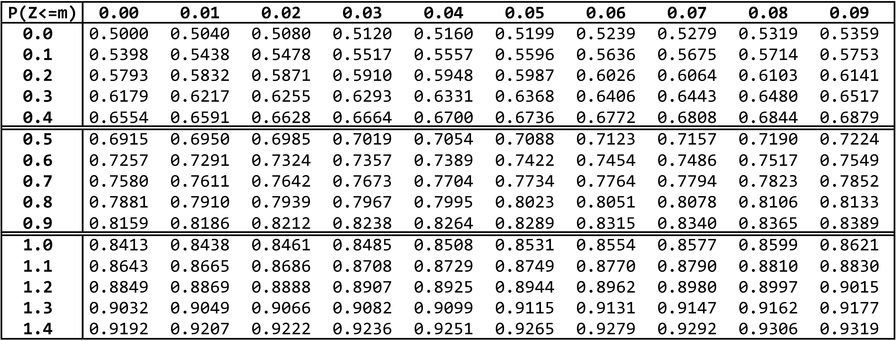
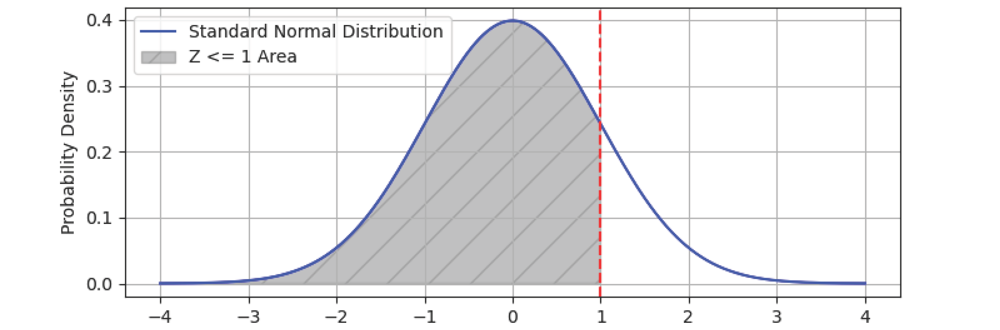

# 正态分布

- 认证：第38次CCF计算机软件能力认证
- 认证编号：38
- 题目序号：1
- 题目编号：191
- 题面 token：191.pLPpCpJQdCciwUgN

---


**时间限制：** 1.0 秒 


**空间限制：** 512 MiB

**相关文件：** [题目目录](../assets/staticdata/191.pLPpCpJQdCciwUgN.pub/Z6CZVnDiFFekXFbp.CSP38-down.zip/CSP38-down.zip)


## 题目描述

对于正态分布随机变量 $X \sim N(\mu, {\sigma}^2)$（均值 $\mu$、标准差 $\sigma$），查表计算 $P(X \le n)$。

具体来说，我们首先需要将 $X$ 转换为标准正态分布 $Z$：
$$
Z = \frac{X - \mu}{\sigma}
$$

那么 $X \le n$ 的概率也就等于 $Z \le \frac{n - \mu}{\sigma}$ 的概率：
$$
P(X \le n) = P(Z \le \frac{n - \mu}{\sigma})
$$

而对于服从标准正态分布的 $Z$，其小于等于某值的概率 $P(Z \le m)$ 可以通过查表得出。图 `1` 展示了 $m$ 取值从 $0.00$ 到 $1.49$ 的结果（步长 $0.01$），其中每列对应 $m$ 的百分位、每行对应 $m$ 的十分位和整数部分。该表可继续向下延伸，这里只展示部分结果。

<p class="text-center">
 
</p>

如图 `2` 所示，$Z \le 1$ 的概率即为阴影部分的面积，查看表中 $1.0$ 对应行、$0.00$ 对应列即可得到近似结果 $0.8413$。

<p class="text-center">
 
</p>

在本题中你需要模拟上述查表的过程，处理 $k$ 个如下查询：对于给定的参数 $\mu$、$\sigma$ 和 $n$，计算 $P(X \le n)$ 的结果在表中的哪一行、哪一列？

其中行列下标均从 $1$ 开始：

* 行：$0.0$ 对应第 $1$ 行，$0.1$ 对应第 $2$ 行，依此类推……
* 列：$0.00, 0.01, \cdots, 0.09$ 依次对应第 $1$、第 $2$ 到第 $10$ 列。

## 输入格式

从标准输入读入数据。

输入的第一行包含一个正整数 $k$，表示查询的个数。

接下来输入 $k$ 行，每行包含空格分隔的三个整数 $\mu$、$\sigma$ 和 $n$，表示一个查询。

## 输出格式

输出到标准输出。

每个查询输出一行，包含空格分隔的两个整数 $i$ 和 $j$，表示查询的结果位于表中第 $i$ 行、第 $j$ 列。


## 样例输入

```plain
4
0 1 1
2 10 127
2 50 227
5 100 350

```


## 样例输出

```plain
11 1
126 1
46 1
35 6

```


## 样例解释

第一个查询等价于计算 $P(Z \le \frac{1 - 0}{1})$，如题目描述所示，查看表中 $1.0$ 对应行（第 $11$ 行）、$0.00$ 对应列（第 $1$ 列）即可。

## 子任务

全部的数据满足：

* $k \le 20$；
* 参数 $\mu$、$\sigma$ 和 $n$ 均为整数；
* $0 \le \mu \le n \le 1000$；
* $1 \le \sigma \le 100$ 且标准差 $\sigma$ 是 $100$ 的因子。
