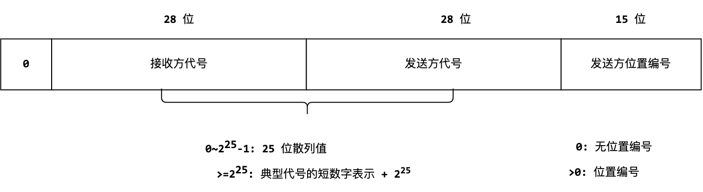
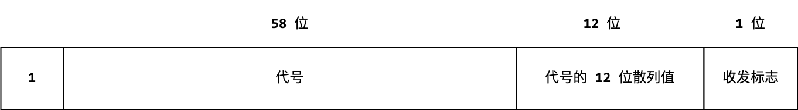
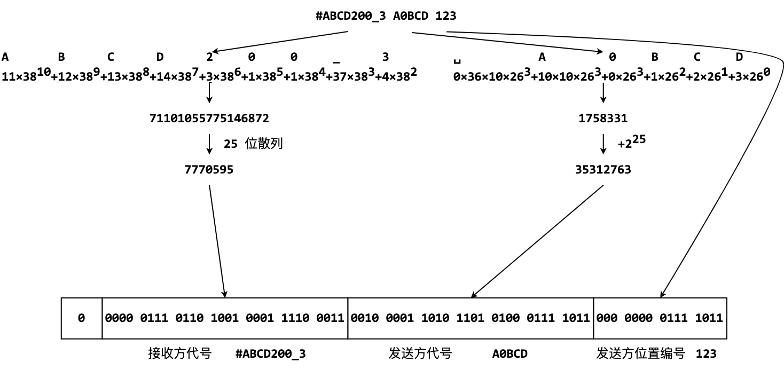
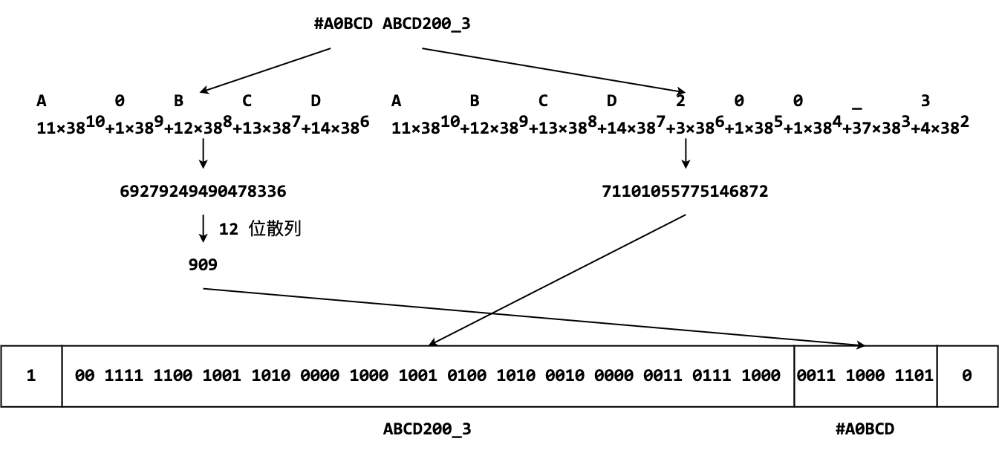

# 消息解码

- 认证：第38次CCF计算机软件能力认证
- 认证编号：38
- 题目序号：3
- 题目编号：193
- 题面 token：193.fS3iDv4IDMxM08ER

---

**时间限制：** 2.0 秒 

**空间限制：** 512 MiB

**相关文件：** [题目目录](../assets/staticdata/191.pLPpCpJQdCciwUgN.pub/Z6CZVnDiFFekXFbp.CSP38-down.zip/CSP38-down.zip)

## 题目背景

西西艾弗岛上的居民经常使用一种短消息服务来互相通信。这种短消息的特点是，每条消息仅需 72 个比特，可以用来发送些简短的信息。
发送的信息包含收发双方的代号和发送方的位置。每位居民都有一个代号，代号包含 1 到 11 个字符，且只能包含大写字母、数字和下划线。特别地，多数居民的代号长 5 到 6 位，并且依次由 1 到 2 位数字或大写字母、1 位数字和 3 位字母组成。符合这样特征的代号被称为**典型代号**。
西西艾弗岛上的位置，可以用数字编号 1 至 32400 表示。

### 代号的数字表示

一个代号可以唯一地用一个数字表示，具体办法是：

1. 将不足 11 位的代号从**结尾**处用空格补充到 11 位；
2. 将每个字符用一个数字表示，数字的计算方法如下：
   - 空格用 0 表示；
   - 数字 `0` 至 `9` 用 1 到 10 表示；
   - 大写字母 `A` 至 `Z` 用 11 到 36 表示；
   - 下划线 `_` 用 37 表示。
3. 将第一个字符的数字乘以 $38^{10}$，第二个字符的数字乘以 $38^9$，第三个字符的数字乘以 $38^8$，……，第十一个字符的数字乘以 $38^0$，然后将这些数相加。

例如，代号 `ABCD200_3` 的数字表示可以计算为：$\underline{11} \times 38^{10} + \underline{12} \times 38^{9} + \underline{13} \times 38^{8} + \underline{14} \times 38^{7} + \underline{3} \times 38^{6} + \underline{1} \times 38^{5} + \underline{1} \times 38^{4} + \underline{37} \times 38^{3} + \underline{4} \times 38^{2} + \underline{0} \times 38^{1} + \underline{0} \times 38^{0} = 71101055775146872$

### 典型代号的短数字表示

典型代号除了常规的数字表示，还有一种更简洁的短数字表示：

1. 将 5 位的代号从**开头**处用空格补充到 6 位；
2. 将第一个字符转换为数字：
   - 空格用 0 表示；
   - 数字 `0` 至 `9` 用 1 到 10 表示；
   - 大写字母 `A` 至 `Z` 用 11 到 36 表示；
3. 将第二个字符转换为数字：
   - 数字 `0` 至 `9` 用 0 到 9 表示；
   - 大写字母 `A` 至 `Z` 用 10 到 35 表示；
4. 将第三个字符转换为数字：
    - 数字 `0` 至 `9` 用 0 到 9 表示；
5. 将第四、五、六个字符转换为数字：
   - 大写字母 `A` 至 `Z` 用 0 到 25 表示；
6. 将第一个字符的数字乘以 $36\times10\times26^3$，将第二个字符的数字乘以 $10\times 26^3$，将第三个字符的数字乘以 $26^3$，将第四个字符的数字乘以 $26^2$，将第五个字符的数字乘以 $26^1$，将第六个字符的数字乘以 $26^0$，然后将这些数相加。

例如，典型代号 `A0BCD` 的短数字表示可以计算为：$\underline{0} \times 36 \times 10 \times 26^3 + \underline{10} \times 10 \times 26^3 + \underline{0} \times 26^3 + \underline{1} \times 26^2 + \underline{2} \times 26^1 + \underline{3} \times 26^0 = 1758331$

### 代号的散列值

为了能在 72 个比特的消息中表达 11 位的代号，并容纳前述信息，居民们采用的方法是：

* 在第一次通信中使用代号的数字表示，此后可以使用代号的**散列值**作为代替，因为散列值的长度较短；
* 如果是典型代号，也可以直接使用其短数字表示来节省空间。

由代号的数字表示可以唯一地计算出代号的散列值，但由代号的散列值不能唯一地计算出代号的数字表示。对于接收消息的一方而言，如果收到的消息中含有代号的散列值，则可以通过此前收到的代号来推算该散列值所对应的代号。代号的 $n$ 位散列值的计算方法如下：

1. 计算代号的数字表示；
2. 将代号的数字表示乘以 47055833459；
3. 将结果除以 $2^{64-n}$，取整数部分；
4. 将结果对 $2^n$ 取模。

例如，代号 `ABCD200_3` 的 25 位散列值可以计算为：

$71101055775146872 \times 47055833459 = 3345719439314381360096790248$

$3345719439314381360096790248 \div 2^{64-25} \mod 2^{25} = 7770595$

（典型）代号 `A0BCD` 的 12 位散列值可以计算为：

数字表示 $\underline{11} \times 38^{10} + \underline{1} \times 38^{9} + \underline{12} \times 38^{8} + \underline{13} \times 38^{7} + \underline{14} \times 38^{6} = 69279249490478336$

$69279249490478336 \times 47055833459 \div 2^{64-12} \mod 2^{12} = 909$

## 题目描述

消息可以被分为两种：简单消息和复杂消息。其中复杂消息包含完整的代号的数字表示；而简单消息仅包含典型代号的短数字表示或代号的散列值，同时可以包含发送方所在位置。

简单消息的第一个二进制位是 0，随后的 28 位（位序为高位在前，下同）表示接收方的代号，随后的 28 位表示发送方的代号，接下来的 15 位是发送方的位置编号。表示一方代号的数字有两种情况：如果是代号的散列值，则为代号的 25 位散列值；如果是典型代号的短数字表示，则为该值加上 $2^{25}$。位置编号如果为 0 表示该消息**不包括位置编号**，否则表示发送方的位置编号。

 

复杂消息的第一个二进制位是 1，随后的 58 位是一方的代号的数字表示；接下来的 12 位是另一方的代号的 12 位散列值；最后的 1 位表示二者的关系：0 表示首先的一方（即用代号的数字表示的那一方）是发送方，1 表示首先的一方是接收方。

 

一条消息的文字表示包含用空格分隔的三部分，分别是接收方的代号、发送方的代号和发送方的位置编号。如果消息不包括位置编号，则无第三部分。
其中，如果一方的代号是用散列值推断的，则在该方的代号前加上井号（`#`）；
如果通过散列值无法推断出该方的代号（可能因为此前的消息没有收到），则用 `###` 表示。
用散列值推断代号时，使用收到该消息**前**接收到的消息中出现过的代号推断。
用于推断的代号包括出现在简单消息中的用短数字表示的典型代号，和出现在复杂消息中的用数字表示的代号；而不包括此前通过散列值间接推断出的。如果有多个代号的散列值都符合，则使用最后收到消息中出现的代号；如果最后收到的消息中的收发双方代号的散列值都符合，则使用最后收到的消息中发送方的代号。

 

 

试编写程序，将给出的消息的比特序列转换为对应的文字表示。

## 输入格式

从标准输入读入数据。

输入的第一行是一个整数 $n$，表示消息的数量。接下来的 $n$ 行中，每行包含一个由 72 个 `0` 或 `1` 组成的字符串，表示先后收到的 $n$ 条 72 比特长的消息。

## 输出格式

输出到标准输出。

输出 $n$ 行，表示这些消息对应的文字表示。

## 样例1

见题目目录下的 *1.in* 与 *1.ans*。

## 样例1解释

前两个输入为题目描述中的例子。需要注意的是，在解析第一个输入时，收到的代号散列值尚不能推断出代号，因此用 `###` 表示。

第三个输入是复杂消息。根据代号的数字表示值解析第一个代号为 `ABCD200_4`，第二个代号的 12 位散列值为 `001110110100`，即 948。此时向前搜索发现曾经出现的 `ABCD200_3` 的 12 位散列值也是 948，因此可以推断出第二个代号为 `ABCD200_3`，并加 `#` 表示这个代号是推断而来的。输入的最后一位是 0，表示第一个代号是发送方，第二个代号是接收方，因此要将 `#ABCD200_3` 放在前面。

第四个输入也是复杂消息，解析得第一个代号为 `PY4XMCHJZTN`、第二个代号的 12 位散列值为 970。此时在前面出现过的代号中找不到 12 位散列值为 970 的代号，因此无法推断出第二个代号，用 `###` 表示。输入的最后一位是 1，表示第一个代号是接收方，第二个代号是发送方，因此要将 `PY4XMCHJZTN` 放在前面。

第五个输入也是复杂消息，解析得第一个代号为 `ABCD200_4`、第二个代号的 12 位散列值为 948。需要注意的是，曾经出现的代号 `ABCD200_3`、`ABCD200_4`、`PY4XMCHJZTN` 的 12 位散列值都是 948，我们选取最近在第四个输入中收到的 `PY4XMCHJZTN` 作为推断的代号，因此得到本条消息的结果。注意虽然第五个输入和第三个输入完全相同，但是由于代号的 12 位散列值发生了碰撞，因此推断出的代号可能不同。

第六个输入也是复杂消息，解析得第一个代号为 `ABCD200_5`、第二个代号的 12 位散列值为 948。这时，选取第五个输入中收到的 `ABCD200_4` 作为推断的代号，因为它是最近收到的 12 位散列值是 948 的代号。需要注意的是，虽然本条消息中出现的代号 `ABCD200_5` 的 12 位散列值也是 948，但是在根据散列值推断代号时，仅考虑此前收到的消息中出现的代号，而不考虑本条消息中出现的代号。

第七个输入和第六个输入相同，此次选取的是第六个输入中收到的 `ABCD200_5` 作为推断的代号。

## 子任务

| 测试点 | $n$ | 额外性质 |
| --- | --- | --- |
| 1, 2, 3 | $\le 100$ | 仅含有复杂消息，且散列值与所有出现的代号均不匹配 |
| 4, 5, 6 | $\le 100$ | 仅含有简单消息，且表示双方代号的数字均不小于 $2^{25}$ |
| 7, 8 | $\le 100$ | 无 |
| 9, 10 | $\le 10^{5}$ | 无 |

全部的数据满足：输入的消息数据一定是按上述编码规则得到的，但可能存在由散列值无法推断出代号的情况。
