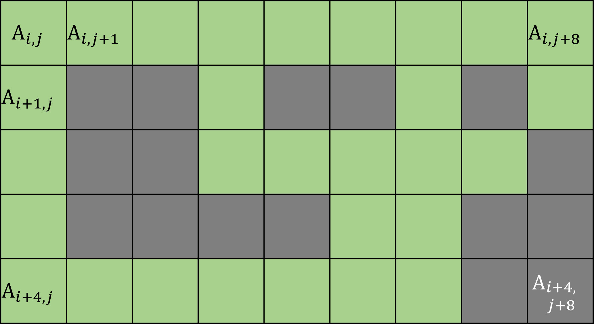

# 水印检查

- 认证：第39次CCF计算机软件能力认证
- 认证编号：39
- 题目序号：2
- 题目编号：197
- 题面 token：197.hNBcDYBx2KeIeQ6N

---
**时间限制：** 1.0 秒 

**空间限制：** 512 MiB

**相关文件：** [题目目录](../assets/staticdata/196.LzNmuc1auGZWsB9R.pub/kUHdgXzCJ3mAXbzB.CSP39-down.zip/CSP39-down.zip)

## 题目背景

一幅长宽分别为 $n$ 个像素和 $m$ 个像素的灰度图像可以表示为一个 $n \times m$ 大小的矩阵 $A$。其中每个元素 $A_{i,j}$（$1 \le i \le n$、$1 \le j \le m$）是一个 $[0, L-1]$ 范围内的整数，表示对应位置像素的灰度值。具体来说，一个 $8$ 比特的灰度图像中每个像素的灰度范围是 $[0, 255]$。

## 题目描述

小 P 在学习了数字图像处理后，设计了一种形如 `CSP` 的水印。具体来说，若想检测出水印，需选定一个阈值参数 $k$，然后将图像二值化：

* 灰度值大于等于 $k$ 的像素变为白色；

* 灰度值小于 $k$ 的像素变为黑色。

然后检查图像中是否有 $5 \times 9$ 的区域如下所示（为方便展示用绿色替代白色）：

<p class="text-center">
 
</p>

即呈现出 `CSP` 三个字母的形状。

该水印较为简单，无需考虑旋转、翻转等复杂情况；只需检查灰度图像 $A$ 是否包含一个大小为 $5 \times 9$ 的子矩阵 $A_{i,j} \cdots A_{i+4,j+8}$，其中大于等于阈值 $k$ 和小于的像素分布与上图完全一致。

对于给定的 $n \times n$ 大小的灰度图像 $A$，试计算出所有能检查出水印 `CSP` 的阈值 $k$。

## 输入格式

从标准输入读入数据。

输入的第一行包含由空格分隔的两个正整数 $n$ 和 $L$，表示图像的大小和像素灰度值的范围。

接下来 $n$ 行输入矩阵 $A$，其中第 $i$ 行（$1 \le i \le n$）包含用空格分隔的 $n$ 个整数，依次为 $A_{i,1}, A_{i,2}, \cdots, A_{i,n}$。

## 输出格式

输出到标准输出。

输出若干行，每行包含一个整数，表示一个可以检查出水印 `CSP` 的阈值 $k$。$[0, L-1]$ 范围内所有可行阈值 $k$ 按从小到大顺序输出。


## 样例输入

```plain
9 256
9 9 8 8 9 9 9 8 255
9 0 0 8 0 0 7 0 8
9 0 0 8 7 9 7 7 5
9 0 0 0 0 8 7 0 0
7 7 8 7 7 8 8 6 5
6 2 2 5 1 1 5 1 6
6 2 2 6 6 6 7 5 3
6 2 2 2 1 5 8 1 1
7 7 8 7 7 8 8 2 3
```


## 样例输出

```plain
4
5
7

```


## 样例解释

$k = 4$ 或 $5$ 时图像如下所示，其中 `*` 和 `-` 分别表示白色和黑色，水印出现在后五行：

```
* * * * * * * * *
* - - * - - * - *
* - - * * * * * *
* - - - - * * - -
* * * * * * * * *
* - - * - - * - *
* - - * * * * * -
* - - - - * * - -
* * * * * * * - -
```

$k = 7$ 时图像如下所示，容易发现前五行（$A_{1,1} \cdots A_{5,9}$）显现出水印 `CSP`：

```
* * * * * * * * *
* - - * - - * - *
* - - * * * * * -
* - - - - * * - -
* * * * * * * - -
- - - - - - - - -
- - - - - - * - -
- - - - - - * - -
* * * * * * * - -
```

## 子任务

$80\%$ 的测试点满足：$n \le 50$、$L = 256$；

全部的测试点满足：$9 \le n \le 200$、$L \in \left\{256, 65536 \right\}$，像素值均在 $[0, L-1]$ 范围内，且保证至少存在一个阈值可以检测出水印 `CSP`。
