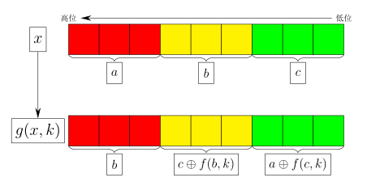

# 数字变换 (transform)

- 认证：第40次CCF计算机软件能力认证
- 认证编号：40
- 题目序号：2
- 题目编号：202
- 题面 token：202.4jwzkqiRt5SL1riW

---
**时间限制：** 1.5 秒 

**空间限制：** 512 MiB

**相关文件：** [题目目录](../assets/staticdata/201.CFjZTiLDcor8eMYI.pub/45v81qaxSvDPr4eY.CSP40-down.zip/CSP40-down.zip)

## 题目描述

小 C 设计了一种变换 $F$，若输入 $\left[0,2^9\right)$ 中的整数，则输出也是 $\left[0,2^9\right)$ 中的整数。

记 $\oplus$ 为按位异或运算，即 C++/Java/Python 中的 `^` 运算符。

若 $x,k$ 均为 $\left[0,2^3\right)$ 内的整数，定义 $f(x,k)=\left(\left(x^2+k^2\right)\bmod 2^3\right)\oplus k$。

若 $x$ 为 $\left[0,2^9\right)$ 内的整数，$k$ 为 $\left[0,2^3\right)$ 内的整数。将 $x$ 的二进制表示进行高位补零的操作，使其恰好为 $9$ 位。$g(x,k)$ 将会把这 $9$ 个二进制位分为高三位、中三位、低三位三组并将其视为三个数字分别进行变换，具体如下图所示：

<p class="text-center">
 
</p>

记 $f_0$ 为 $F$ 变换的输入值，并定义 $f_i=g(f_{i-1},k_i)$，$i\in\{1,2,3,\cdots,m\}$，则 $f_m$ 为 $F$ 变换的输出值。长为 $m$ 的序列 $k$ 是一个给定的参数序列，并且其中每个数字都是 $\left[0,2^3\right)$ 之间的整数。

现在小 C 有 $n$ 个经过 $F$ 变换后得到的值，分别为 $a_1,a_2,\cdots,a_n$，小 C 想知道它们对应的输入分别是什么。

## 输入格式

从标准输入读入数据。

第一行两个正整数 $n,m$。

第二行有 $m$ 个非负整数，分别为 $k_1,k_2,\cdots,k_m$。

第三行有 $n$ 个非负整数，分别为 $a_1,a_2,\cdots,a_n$。

## 输出格式

输出到标准输出。

输出一行 $n$ 个非负整数，表示 $a_1,a_2,\cdots,a_n$ 对应的输入。

## 样例1输入

```plain
1 2
3 5
504

```

## 样例1输出

```plain
101

```

## 样例1解释

**可以枚举可能的输入并验证。**

若枚举到的输入为 $f_0=101$。

对于 $f_1=g(101,3)$ 来说：$a=1$，$b=4$，$c=5$，$c\oplus f(b,3)=7$，$a\oplus f(c,3)=0$，故 $f_1=312$。

对于 $f_2=g(312,5)$ 来说：$a=4$，$b=7$，$c=0$，$c\oplus f(b,5)=7$，$a\oplus f(c,5)=0$，故 $f_2=504$。

因此若输入为 $101$，则输出为 $504$，因此 $101$ 是其对应的输入。

如果枚举的输入是别的数字，可以同上验证其输出不是 $504$。

## 样例2

见题目目录下的 *2.in* 与 *2.ans*。

## 样例3

见题目目录下的 *3.in* 与 *3.ans*。

## 子任务

$80\%$ 的测试数据满足：$1\le n\le 100$，$1\le m\le 20$。

$100\%$ 的测试数据满足：$1\le n\le 5 \times 10^{5}$，$1\le m \le10^{3}$，$0\le k_i<2^3$，$0\le a_i<2^9$，且只有唯一的输入能够得到这些输出。
