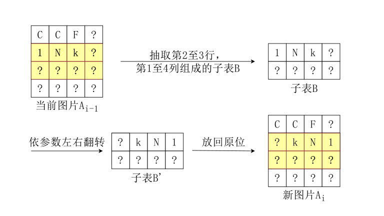
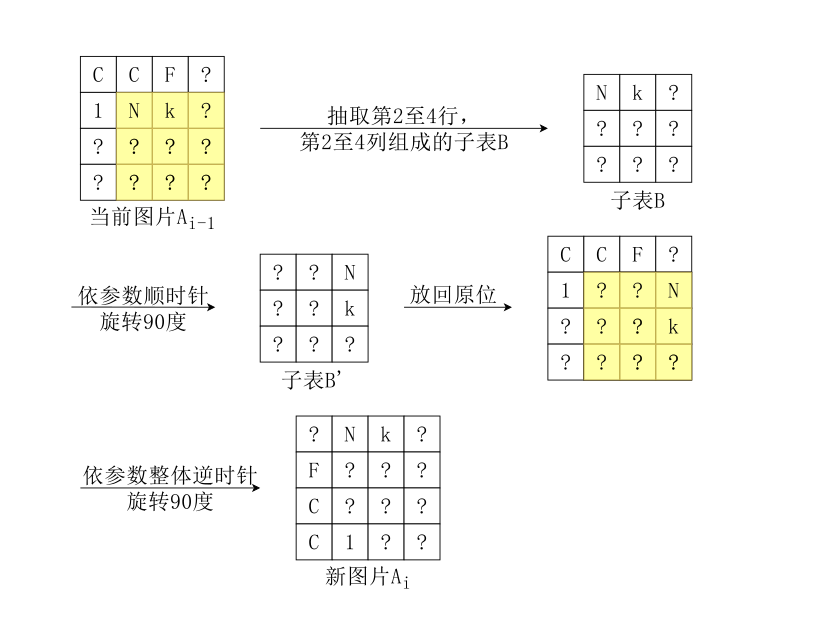
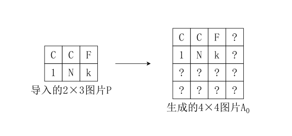

# 图片解码 (decode)

- 认证：第40次CCF计算机软件能力认证
- 认证编号：40
- 题目序号：3
- 题目编号：203
- 题面 token：203.lUWmBeFBH6ZYym4p

---
**时间限制：** 1.5 秒 

**空间限制：** 512 MiB

**相关文件：** [题目目录](../assets/staticdata/201.CFjZTiLDcor8eMYI.pub/45v81qaxSvDPr4eY.CSP40-down.zip/CSP40-down.zip)

## 题目背景

西西艾弗岛上的居民经常使用 InkGraph 系统来对自己的图片进行加密操作。加密方在加密图片时，将图片输入该系统后可以得到一份系统文件与一个对应的密钥；如果想要获取图片的原始信息，接收方需要获取该系统文件与对应的密钥并将它们输入系统，经系统解码后便能获得原始图片。

具体来说，一张图片可以由一个 $n\times m$ 的字符表格 $P$ 来表示，其中位于从上向下数第 $i$ 行，从左向右数第 $j$ 列的字符可以用 $P_{i,j}$（$1\leq i\leq n,1\leq j\leq m$）来表示。这些字符中**仅含有大小写字母、数字和下划线**。新加入开发团队的小 C 学习了这个系统的加密方法。

### 加密步骤

加密方在加密一张图片 $P$ 前，需预先设定一个整数规模参数 $Z$（$1\leq Z\leq 400$）。在导入图片 $P$ 后，系统会自动在右下方用字符 `?` 将其补齐成一张 $Z\times Z$ 的正方形图片 $A_0$。
一个对 $2\times 3$ 图片加密，并设置 $Z=4$ 的例子如下：

<p class="text-center">
  
</p>

系统此时会向用户请求加密次数 $t$，满足 $1\leq t\leq 5\times 10^4$。然后系统会从图片 $A_0$ 开始，进行 $t$ 次加密操作。具体来说，第 $i$ 次加密操作的输入为 $A_{i-1}$，输出为 $A_i$。$t$ 次加密操作结束后，系统会将加密后的最终结果图 $A_t$ 与代表加密过程的**密钥**（一个整数序列 $K$）输出到加密方获取的系统文件中。在加密过程开始前，系统先向空的密钥 $K$ 中添加一个整数 $t$，即设置 $K_1=t$。

对于第 $i$ 次加密操作，系统会先自动选择一个加密类型 $op_i\in\{1,2\}$。

如果 $op_i=1$，那么第 $i$ 次加密是一次**旋转加密**。系统会生成一个五维整数向量 $(u_i,v_i,L_i,d_i,r_i)$，满足
$1\leq u_i\leq Z,1\leq v_i\leq Z,1\leq L_i\leq \min\{Z,10\},u_i+L_i-1\leq Z,v_i+L_i-1\leq Z,d_i\in\{90,180,270\},0\leq r_i\leq 3$，然后抽取出图片 $A_{i-1}$ 的从第 $u_i$ 到第 $u_i+L_i−1$ 行，第 $v_i$ 到第 $v_i+L_i−1$ 列的大小为 $L_i\times L_i$ 的正方形子表 $B$，将 $B$ **顺时针**旋转 $d_i$ 度（角度制）后放在原来的位置上（字符本身**不会**被旋转）；旋转完成后，再对这张图整体进行 $r_i$ 次**逆时针**旋转 $90$ 度的操作，从而得到本次加密的结果图 $A_{i}$。将上例图片作为 $A_{i-1}$ 进行一次 $(2,2,3,90,1)$ 的旋转加密的过程如下，得到本次加密操作的结果图片 $A_{i}$：

<p class="text-center">
  
</p>

在本次加密完成后，系统会在密钥序列 $K$ 的**后方依次追加 $op_i,u_i,v_i,L_i,d_i,r_i$** 这 $6$ 个数。例如若上述加密过程为第一次加密，密钥序列 $K$ 应形如 $\{t,1,2,2,3,90,1\}$。

如果 $op=2$，那么第 $i$ 次加密是一次**翻转加密**：系统会生成一个五维整数向量 $(u_i,d_i,l_i,r_i,o_i)$，满足 $1\leq u_i\leq d_i\leq Z,1\leq l_i\leq r_i\leq Z,1\leq d_i-u_i+1\leq\min\{Z,10\},1\leq r_i-l_i+1\leq\min\{Z,10\},o_i\in\{-1,1\}$，然后抽取出当前图片 $A_{i-1}$ 的第 $u_i$ 到第 $d_i$ 行，第 $l_i$ 到第 $r_i$ 列的大小为 $(d_i−u_i+1)\times(r_i−l_i+1)$ 的矩形子表 $B$；当 $o_i=1$ 时，将 $B$ **上下**翻转；当 $o_i=-1$ 时，将 $B$ **左右**翻转（字符本身**不会**被翻转），然后放在原来的位置上，从而得到本次加密的结果图 $A_{i}$。将上例图片作为 $A_{i-1}$ 进行一次 $(2,3,1,4,-1)$ 的翻转加密的过程如下，得到本次加密的结果图片 $A_{i}$：

<p class="text-center">
  
</p>

在本次加密完成后，系统会在密钥序列 $K$ 的**后方依次追加 $op_i,u_i,d_i,l_i,r_i,o_i$** 这 $6$ 个数。例如若上述加密过程为第一次加密，密钥序列 $K$ 应形如 $\{t,2,2,3,1,4,-1\}$。

全部 $t$ 次加密过程结束后，最终结果图 $A_t$ 和密钥 $K$ 会被输出至系统文件中。

## 题目描述

小 C 对 InkGraph 系统的解码方法非常感兴趣，想要上手编写这个解码的程序。换句话说，现在他获得了一份系统文件，含有加密的最终结果图 $A_t$ 与对应的密钥序列 $K$，他的程序需要能够还原出加密方导入的原始的图片 $P$。现在，请你帮他完成这个任务。

## 输入格式

从标准输入读入数据。

输入的第一行是一个正整数 $Z$。**保证 $Z$ 不小于加密方输入图片的长和宽**，也即加密程序能够正常运作；

接下来的 $Z$ 行为最终的结果图片 $A_t$。保证每行恰有 $Z$ 个字符，且输入的字符**仅包含大小写字母、数字、下划线和问号**。

接下来输入一行一个正整数 $k$，表示密钥 $K$ 的长度；然后下一行输入 $k$ 个由空格分隔的整数，表示密钥 $K$。

## 输出格式

输出到标准输出。

第一行输出用空格分隔的两个整数 $n$ 和 $m$，表示还原出的图片 $P$ 的宽度与长度。

接下来输出 $n$ 行，每行 $m$ 个字符，仅含有大小写字母、数字和下划线，表示原本的图片。

## 样例1输入

```plain
4
?Nk?
??F?
??C?
C1??
13
2 1 2 2 3 90 1 2 2 3 1 3 -1
```

## 样例1输出

```plain
2 3
CCF
1Nk
```


## 样例1解释

样例中系统进行了 $2$ 次加密，原始图片 $A_0$ 如案例所示。第一次加密为旋转加密，过程如案例中所示；第二次加密为翻转加密，其生成的五元向量参数为 $(2,3,1,3,-1)$。


## 样例2

见题目目录下的 *2.in* 与 *2.ans*。

该样例中的数据满足 $op_i=2$。

## 样例3

见题目目录下的 *3.in* 与 *3.ans*。

## 子任务


| 测试点编号 | 约束 |
| --- | --- |
| $1\sim 5$ | 保证 $op_i=2$ 且 $Z\leq 10$ |
| $6\sim 10$ | 保证 $op_i=2$ |
| $11\sim 15$ | 保证 $Z\leq 10$ |
| $16\sim 20$ | 保证 $Z\leq 400$ |

