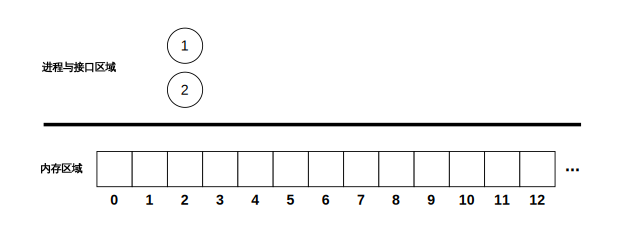
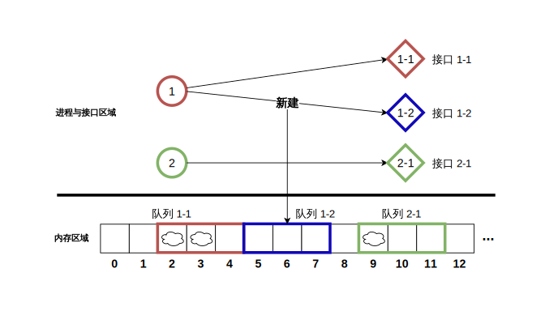
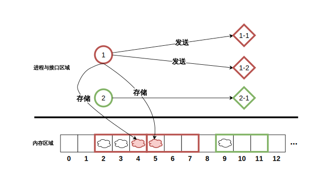
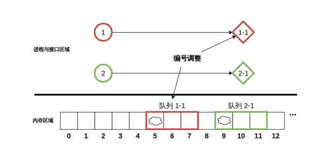

# 进程通信（communicate）

- 认证：第41次CCF计算机软件能力认证
- 认证编号：41
- 题目序号：3
- 题目编号：208
- 题面 token：208.6CxbvEBm0h5a1rCz

---
**时间限制：** 1.0 秒 

**空间限制：** 512 MiB

**相关文件：** [题目目录](../assets/staticdata/206.UjQeTb14qfuzGrEQ.pub/5ldjdsBXTvM2qX9L.CSP41-down.zip/CSP41-down.zip)

## 题目背景

某一天，西西艾弗岛上的居民们迎来了一个天大的好消息：他们终于有了自己的操作系统。这个操作系统有一个特性：其内部每个进程都具有动态链接接口并对外广播信息的功能。小 C 的团队负责开发该功能与内存间交互的必要环节，同时维护支持内存调度与分配的子系统。

这套系统刚开发完毕，运行稳定性未知，于是小 C 团队邀请了你来当模拟测试员。他们希望你能够帮忙模拟出这套系统的运作流程，对于各种可能情况给出其具体行为，从而帮助他们完善这套系统。由于你们的合作刚处于起步阶段，小 C 为你提供了一个简化后的模型。

### 初始建构：

首先认为有一段存储容量为 $10^{100}$（保证足够大） 的初始为空的全局内存，内存地址从左到右依次编号 $0,1,2\cdots$。为了简化模型，视这段内存的每一个字节可以存储一个对象，且我们并不关心对象具体内容。因此本题中只需用 $e_i\in\{0,1\},x_i\in\{0,1\}$ 两个状态变量代表 $i$ 号地址处**是否被占用**以及**是否有对象被存储**；其中 $e_i=1$ 代表地址 $i$ 被占用，$e_i=0$ 代表未被占用；$x_i=1$ 代表有对象存储，$x_i=0$ 代表没有。初始时所有 $e_i,x_i$ 均为 $0$。

接下来考虑有 $n$ 个准备进行对象传输的进程，依次编号 $1,2,\cdots,n$，一开始没有任何接口与它们对接。初始状态下系统中各对象的逻辑关系可以用下图表示（例 $n=2$）：

<p class="text-center">
 
</p>

### 通信行为：

将系统内各对象的行为以操作的形式封装，接下来定义小 C 的模型中所有可能发生的操作：

`new p L`：建立一个只负责接收进程 $p$ 所发出对象的新接口，同时建立在进程 $p$ 与该接口之间进行消息传递的队列，队列存储容量为 $L$。

- 设在该操作之前进程 $p$ 共对接了 $k$ 个接口，新建的接口会被编号为 $k+1$。注意，新建的接口与队列具有对应关系，且它们均独属于进程 $p$。

- 接下来分配器会响应，根据**最优适应原则**存储队列。具体来说：

    - 分配器首先会识别内存中所有**极长的未被占用的连续地址段**，它们从左到右可以写成若干个非空区间的形式 $[l_1,r_1],[l_2,r_2],\cdots,[l_{t-1},r_{t-1}],[l_t,r_t]$。其中 $r_t=10^{100}$。从左到右第 $i$ 段的长度为 $r_i-l_i+1$。
    - 接下来它会在这些段中寻找**长度 $\geq L$ 且尽可能短**的段（若有多个满足条件的段，则取左端点 $l$ 最小的段）$[l,r]$；
    - 将连续地址段 $[l,l+L-1]$ 分配给接口 $k+1$，用于存储队列中的信息。这段长度为 $L$ 的内存空间每个位置此刻起均视为被占用，也即 $\forall j\in[l,l+L-1]$，令 $e_j=1$。

下例中，进程 $1,2$ 在操作执行前均已对接各自的 $1$ 号接口，分别占用内存区域 $[2,4]$ 与 $[9,11]$；进行一次 `new 1 3` 操作后，进程 $1$ 对接了自身的 $2$ 号接口，并在内存区域 $[5,7]$ 建立了对应的队列：

<p class="text-center">
 
</p>

`send p`：进程 $p$ 同时向所有其对接的接口发送一个对象。具体来说，设 $p$ 对接了 $k$ 个接口，则 $\forall i\in[1,k]$，均进行如下操作：

- 找到与 $p$ 对接的编号为 $i$ 的接口对应的队列，其在内存中占用的地址区间为 $[a,b]$。

- 如果队列为空（即接口建立以来进程 $p$ 从未向该接口发送过任何对象），则将对象存储在 $a$ 处，令 $x_a=1$。

- 否则进程 $p$ 向该接口发送过至少一个对象。记**最近一次**发送时，对象被存储在了位置 $t\in[a,b]$ 处。若 $t<b$，则该次发送将对象存储在地址 $t+1$ 处，令 $x_{t+1}=1$；否则 $t=b$，此时将对象存储在地址 $a$ 处，令 $x_a=1$。注意该操作**可能不对某个地址的属性 $x$ 造成改动**。

在上例的基础上，进行一次 `send 1` 操作，$1$ 号进程会在两个队列分别占有的 $4,5$ 号地址处各存储一个对象：

<p class="text-center">
 
</p>

额外说明：如果在此之后连续执行 $4$ 次 `send 2` 操作，则队列 $2-1$ 会依次在地址 $10,11,9,10$ 存储对象。

`delete p i`：设进程 $p$ 对接了 $k$ 个接口，该操作保证 $1\leq i\leq k$。该操作使编号为 $i$ 的接口及队列均被删除，删除时遵循如下流程：

- 找到与进程 $p$ 对接的编号为 $i$ 的接口对应的队列，其在内存中占用的地址区间为 $[a,b]$。

- $\forall i\in[a,b]$，将 $e_i$ 与 $x_i$ 均置为 $0$，视为**删除所有存储在其中的对象，并将各个地址的占用状态取消**。

- 将与进程 $p$ 所对接的其余编号大于 $i$ 的接口的编号均减去 $1$，接口与队列的对应关系不变。例如一次操作前进程 $p$ 对接了 $4$ 个接口，则通过操作删除 $2$ 号接口及队列后，原先编号为 $3,4$ 的接口与队列的编号会被依次更新为 $2,3$。

在上例的基础上，进行一次 `delete 1 1` 操作，则 $1$ 号进程原先对应的 $1$ 号队列及其内部的对象均会被删除：

<p class="text-center">
 
</p>

以上便是小 C 给出的简化模型的所有基本事件定义。

## 题目描述

现在小 C 给出了一个长度为 $q$ 的操作序列，每个操作都为上述三种之一。你需要严格按照顺序模拟这些操作的运行。

小 C 为了检查模拟程序运行的过程是否正确，要求你进行如下反馈输出：

- 每次执行完 `new p L` 操作，你需要输出进程 $p$ 所对接的新接口相应队列在内存中存储的地址。设其存储在区间 $[a,b]$，你只需输出 $a$。

- 每次执行完 `send p` 操作，在进程 $p$ 向其对接的 $k$ 个接口均发送一个对象后，你需要输出该操作中 $k$ 个新发送的对象所存储的地址的和。

为了让你们之间的合作能更进一步，请你完成小 C 的模拟任务吧！

## 输入格式

从标准输入读入数据。

第一行用空格隔开的两个整数 $n,q$，依次代表进程数量与操作数量。

接下来 $q$ 行，每行为一个操作。操作格式如题目背景所描述。单词与数字、数字与数字之间由一个空格隔开。

## 输出格式

输出到标准输出。

请你对于每一个 `new` 操作与 `send` 操作，按照题目要求输出一行一个整数。

## 样例1输入

```plain
2 13
new 1 2
new 1 3
send 1
delete 1 1
new 1 4
send 1
new 2 3
send 2
delete 1 2
new 1 3
send 1
delete 1 1
send 1
```

## 样例1输出

```plain
0
2
2
5
8
9
9
5
9
6
```

## 样例1解释

读入数据自初始状态起进行完前 $9$ 次操作后变为操作解释中的状态。

每次新建操作的初始地址依次为 $0,2,5,9,5$；

每次发送操作所存储的所有对象所在地址和依次为 $2,8,9,9,6$。

## 样例2

见题目目录下的 *2.in* 与 *2.ans*。

## 样例3

见题目目录下的 *3.in* 与 *3.ans*。

## 子任务

保证操作均有意义。即不会建立空队列，不会在进程 $x$ 没有对接任何接口时发送对象，不会删除不存在的队列与接口。特别注意：**向某长度为 $l$ 的队列发送超过 $l$ 个对象的行为是有意义的。**

记所有 `new` 操作中的参数 $L$ 的最大值为 $L_{m}$。

- 对于前 $40\%$ 的测试数据，保证不存在 `delete` 操作；

- 对于前 $80\%$ 的测试数据，保证 $L_m\leq 10,q\leq 800$；

对于所有测试数据，保证 $1\leq n\leq 100,1\leq q\leq 8000,1\leq L_m\leq 5\times 10^5$，除操作名称外所有输入数据均为非负整数。
