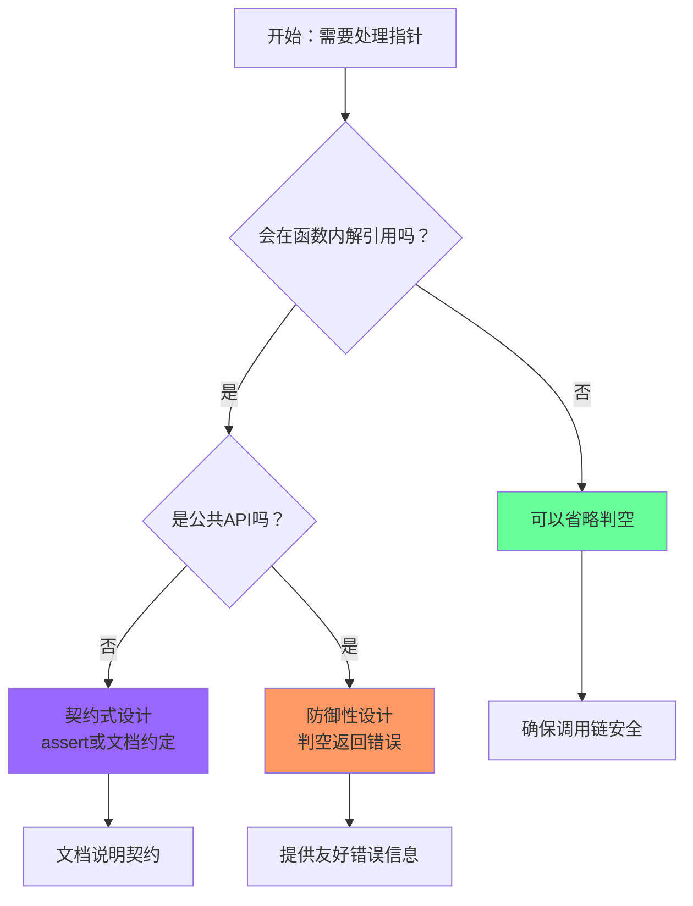

# 空指针检查指南：何时及如何进行判空

基于线索二叉树 (`threadTree.h`) 的实现经验，本文总结在C语言编程中何时需要进行空指针检查。

## 📊 目录
1. [核心原则](#核心原则)
2. [必须判空的情况](#必须判空的情况)
3. [建议判空的情况](#建议判空的情况)
4. [可以省略的情况](#可以省略的情况)
5. [实际代码示例](#实际代码示例)
6. [判空决策流程图](#判空决策流程图)
7. [最佳实践建议](#最佳实践建议)

## 🔍 核心原则

### 黄金法则
1. **"解引用前，必判空"**：最核心的规则
2. **"公共入口，要防御"**：API函数要保护调用者
3. **"递归基线，判空止"**：递归必须有终止条件
4. **"资源操作，先验身"**：操作前验证有效性
5. **"错误路径，清干净"**：失败时要安全清理

### API设计哲学
| 设计策略 | 代码示例 | 适用场景 |
|----------|----------|----------|
| **防御性设计** | `if(param==NULL) return error;` | 公共API、库函数、外部接口 |
| **契约式设计** | `assert(param!=NULL);` | 内部函数、调试版本、性能关键路径 |
| **传递责任** | 不检查，文档说明非空 | 私有辅助函数、调用链内部 |

## 🚨 必须判空的情况（红色警戒区）

### 1. 解引用指针前
```c
// ❌ 危险：直接解引用
int data = ptr->data;  // 可能崩溃

// ✅ 安全：先判空
if(ptr != NULL){
    int data = ptr->data;
} else {
    // 错误处理
}
```

### 2. 函数参数接收时
如果函数接收指针参数并会在内部解引用，必须判空。

```c
// threadTree.h 中的例子
ThreadNode* firstNode(ThreadNode* p){
    if(p==NULL) return NULL;  // ✅ 入口检查
    while(p->ltag==0 && p->lchild!=NULL) p = p->lchild;
    return p;
}
```

### 3. 递归基线条件
所有递归函数必须有判空作为终止条件。

```c
void inThread(ThreadTree p,ThreadTree* pre){
    if(p==NULL) return;  // ✅ 递归终止
    inThread(p->lchild,pre);
    // ... 处理当前节点
    inThread(p->rchild,pre);
}
```

### 4. 循环条件中
在循环中访问指针内容前，必须判空。

```c
// ✅ 正确：先判空再访问
while(p!=NULL && p->ltag==0){
    p = p->lchild;
}

// ❌ 危险：可能访问空指针
while(p->ltag==0){  // 如果p为NULL，这里崩溃
    p = p->lchild;
}
```

### 5. 内存分配检查
```c
ThreadNode* node = (ThreadNode*)malloc(sizeof(ThreadNode));
if(node == NULL){
    // 处理内存分配失败
    return NULL;
}
```

## ⚠️ 建议判空的情况（黄色注意区）

### 1. 公共API入口
即使函数内部不立即解引用，也应检查以提供更好的错误信息。

```c
void inOrder(ThreadTree t){
    if(t==NULL){  // ✅ 提供友好行为
        printf("Empty tree\n");
        return;
    }
    // ... 遍历逻辑
}
```

### 2. 外部输入处理
来自用户、网络、文件等不可信来源的数据。

### 3. 函数返回指针前
```c
ThreadNode* nextNode(ThreadNode* p){
    if(p==NULL) return NULL;  // ✅ 保护调用者
    if(p->rtag==0){
        return p->rchild!=NULL ? firstNode(p->rchild) : NULL;
    } else {
        return p->rchild;  // 可能是NULL
    }
}
```

## ✅ 可以省略的情况（绿色安全区）

### 1. 局部新建的指针
```c
void example(){
    int* ptr = malloc(sizeof(int));
    *ptr = 42;  // ✅ 可以立即使用，因为刚分配
    free(ptr);
}
```

### 2. 明确的非空保证
```c
// 前面代码已经确保非空
ThreadNode* node = newThreadNode(10);
if(node != NULL){
    process(node);  // process内部可以不判空
}
```

### 3. 性能关键路径
在确定安全且性能要求极高的情况下（谨慎使用）。

## 📝 实际代码示例

### threadTree.h 中的判空模式

| 函数 | 判空位置 | 理由 | 代码片段 |
|------|----------|------|----------|
| `creatThreadTree` | 函数入口 | 公共API，防御性设计 | `if(t==NULL) return;` |
| `inThread` | 函数入口 | 递归基线条件 | `if(p==NULL) return;` |
| `firstNode` | 函数入口 | 工具函数，会被多次调用 | `if(p==NULL) return NULL;` |
| `nextNode` | 函数入口+内部 | 访问`p->rtag`前必须判空 | 多重检查 |
| `inOrder` | 函数入口 | 遍历开始前检查有效性 | `if(t==NULL) return;` |
| `freeThreadTree` | 函数入口 | 资源释放要宽容 | `if(root==NULL) return;` |

### 完整示例：安全的函数设计
```c
// 防御性设计示例
ThreadNode* safeNextNode(ThreadNode* p){
    // 1. 入口检查
    if(p == NULL){
        log_error("safeNextNode: NULL input");
        return NULL;
    }
    
    // 2. 解引用前检查
    if(p->rtag == 0){
        // 3. 递归调用（内部会判空）
        if(p->rchild == NULL){
            log_warning("safeNextNode: rchild is NULL when rtag=0");
            return NULL;
        }
        return firstNode(p->rchild);
    } else {
        // 4. 返回线索指针（可能是NULL）
        return p->rchild;
    }
}
```

## 🔄 判空决策流程图



## 🎓 工作流建议

### 编码阶段：倾向于防御
```c
// 写函数时的思维流程：
// 1. 这个函数会解引用参数吗？ → 是 → 加判空
// 2. 这个函数会被外部调用吗？ → 是 → 加判空  
// 3. 参数来自可信来源吗？ → 否 → 加判空
```

### 测试阶段：使用断言
```c
// 调试版本，使用assert快速发现问题
#define DEBUG_MODE 1
#if DEBUG_MODE
    #define SAFE_CHECK(ptr) assert((ptr) != NULL)
#else
    #define SAFE_CHECK(ptr) 
#endif

void debugFunction(ThreadNode* node){
    SAFE_CHECK(node);  // 只在调试时检查
    // ... 函数逻辑
}
```

### 发布阶段：平衡安全与性能
```c
// 发布版本，保留必要的判空
ThreadNode* releaseNextNode(ThreadNode* p){
    // 必要检查保留
    if(p == NULL){
        // 生产环境日志
        production_log(LOG_ERROR, "NULL pointer in releaseNextNode");
        return NULL;
    }
    
    // 内部检查可能简化（如果确定安全）
    if(p->rtag == 0){
        // 假设rchild非空（因为rtag=0表示有右子树）
        return firstNode(p->rchild);
    }
    return p->rchild;
}
```

## 💡 实用技巧

### 1. 链式判空
```c
// 检查多层指针
if(root != NULL && root->lchild != NULL && root->lchild->rchild != NULL){
    // 安全访问
    int data = root->lchild->rchild->data;
}
```

### 2. 错误处理模板
```c
#define CHECK_NULL(ptr, retval) \
    do { \
        if((ptr) == NULL) { \
            fprintf(stderr, "NULL at %s:%d\n", __FILE__, __LINE__); \
            return (retval); \
        } \
    } while(0)

int safeFunction(ThreadNode* node){
    CHECK_NULL(node, -1);  // 自动返回-1并打印位置
    // ... 安全使用node
    return 0;
}
```

### 3. 资源清理模式
```c
void cleanupExample(ThreadNode* tree, FILE* file, void* buffer){
    // 顺序不重要，但都要判空
    if(buffer != NULL) free(buffer);
    if(tree != NULL) freeThreadTree(tree);
    if(file != NULL) fclose(file);
}
```

## 📚 学习建议

1. **初学者**：多判空，建立安全意识
2. **中级开发者**：学习契约式设计，理解性能权衡
3. **高级开发者**：根据上下文选择策略，设计清晰的API契约

## 🎯 总结

判空不是"越多越好"，而是**在正确的地方做正确的检查**。记住：

- **安全第一**：崩溃的软件比慢的软件更糟糕
- **明确契约**：文档化函数的预期输入
- **分层设计**：外层防御，内层假设
- **适度平衡**：在安全性和性能间找到合适点

通过 `threadTree.h` 的实践，我们看到了良好的判空模式：几乎所有接收指针的函数都进行入口检查，这为调用者提供了安全保障，同时内部函数可以基于这些保证进行简化。

---
*最后更新：基于线索二叉树实现的实践经验*